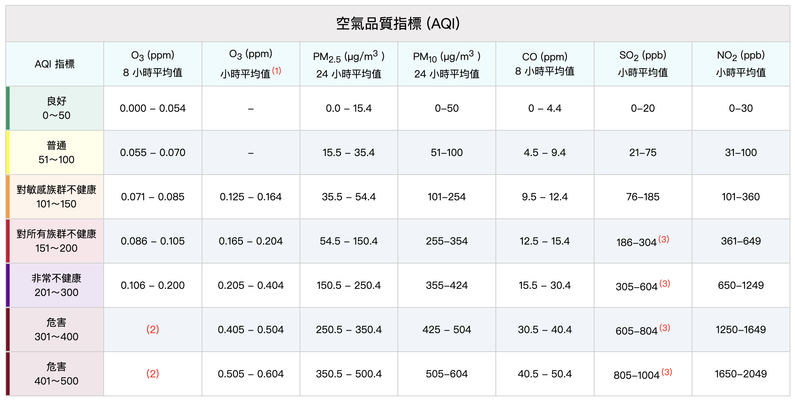

#期中專案點餐機 

##簡介 
利用課堂中所學，自己選定一個點餐系統作為參考模板，用程式編寫出類似應用之作業。此點餐系統以五桐號線上訂餐作參考源，用戶可以選擇飲料類型、甜度、冰塊、優惠方案、支付方式和發票開立方式。 

##功能 
選擇飲料類型 
選擇甜度和冰塊 
確認訂單並顯示價格
選擇優惠方案 
選擇支付方式（現金、Line pay） 
選擇發票開立方式（紙本、手機載具、捐贈） 
完成訂單 
///////////////////////// 
#空氣品質AQI計算機 

##簡介 
依據環境部aqi指標，建立一個互動工具，讓使用者輸入污染物濃度後即可得到個別指數。 

